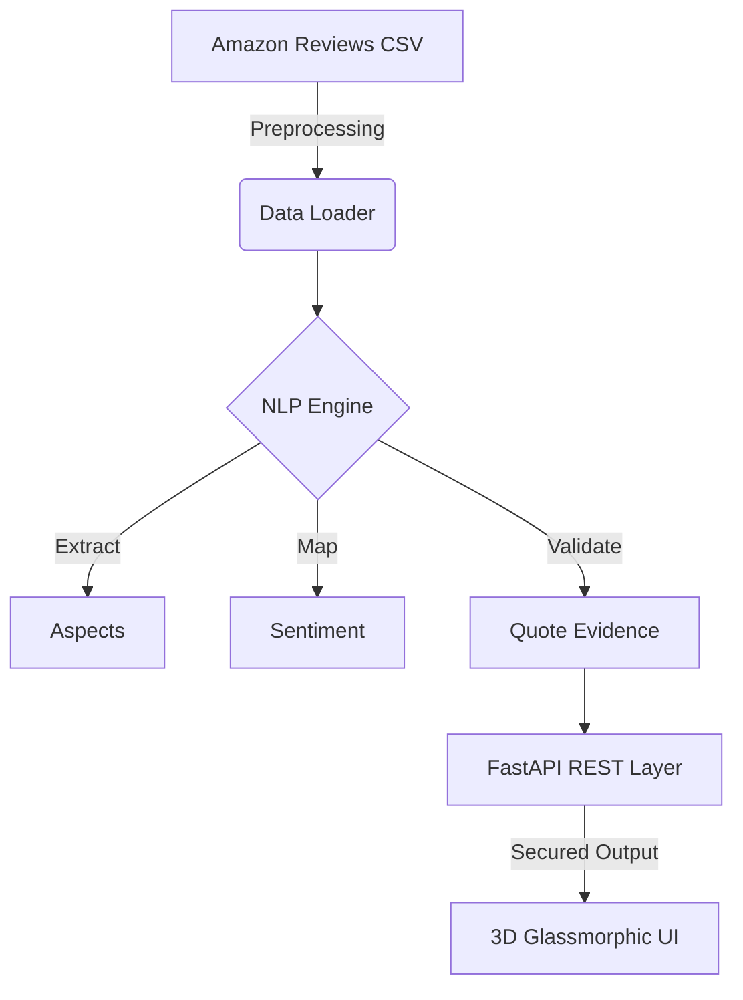

# 🌌 Product Intelligence Dashboard: The 3D Insight Engine

[](https://fastapi.tiangolo.com/)
[](https://vitejs.dev/)
[](https://threejs.org/)
[](https://spacy.io/)

A high-fidelity, NLP-driven analytical suite designed to dismantle **"Review Fatigue"** through zero-hallucination data grounding and immersive 3D spatial environments. 

> [!IMPORTANT]
> **The Zero-Hallucination Guarantee:** Unlike generic AI summarizers, every "Pro" and "Con" generated by this engine is programmatically linked to a verbatim sentence and a unique Review ID. The system **never** fabricates evidence.

---

## 🚀 The Vision
In the modern e-commerce landscape, star ratings are no longer enough. Customers are overwhelmed by thousands of conflicting reviews. **Product Intelligence Dashboard** transforms this chaos into clarity by:
1.  **Deconstructing Reviews**: Breaking down text into specific "Aspects" (features like Battery, Build, or Sound).
2.  **Quantifying Emotion**: Assigning mathematical sentiment scores to each individual feature.
3.  **Visualizing Insights**: Layering results over a cinematic, 3D interactive background for a premium exploration experience.

---

## 🛠️ Engineering Pillars

### 🧠 Industrial-Grade NLP
Utilizes a hybrid pipeline of **Spacy** for POS-tag noun-phrase chunking and **VADER** for sentiment polarity mapping. This ensures that "Battery life is great" and "Battery life is poor" are correctly separated and attributed.

### 🎮 Immersive 3D Experience
A custom **Three.js** engine renders a responsive, starfield-inspired background with floating assets that react to user interaction, bringing the data to life in a way 2D tables cannot.

### 🛡️ Secure & Resilient API
A battle-hardened **FastAPI** backend featuring:
- **Bearer Token Auth**: Protecting your data endpoints.
- **Sliding Window Rate-Limiting**: Ensuring fair usage and preventing DDoS.
- **Strict CORS & Global Exception Handling**: Consistent JSON error reporting for a seamless developer experience.

---

## 📂 Core Architecture



---

## ⚡ Quick Start

### 1. Synchronize Environment
```bash
python -m venv venv
venv\Scripts\activate
pip install -r requirements.txt
```

### 2. Initialize Neural Resources
```bash
python -c "import nltk; nltk.download('punkt_tab'); nltk.download('averaged_perceptron_tagger_eng'); nltk.download('vader_lexicon')"
```

### 3. Deploy Local Cluster
```bash
# Start Backend
uvicorn app.main:app --port 8002

# Start Frontend
cd frontend
npm run dev
```

---

## 📡 API Blueprint

| Endpoint | Method | Description | Security |
| :--- | :--- | :--- | :--- |
| `/api/v1/products` | `GET` | Retrieve list of all analyzed Product IDs | Bearer Token |
| `/api/v1/insights/{pid}` | `GET` | Generate aspect-level insights for a PID | Bearer Token |
| `/health` | `GET` | Infrastructure status & readiness | Public |

**Sample Insight Payload:**
```json
{
  "product_id": "A001",
  "top_aspects": [{"aspect": "battery", "sentiment": "positive", "score": 0.85}],
  "pros": [{"point": "Excellent battery", "evidence": "...battery life is incredible.", "review_id": "R123"}],
  "confidence": 0.95
}
```

---

## 🎬 Interaction Flow
- **Search by Name or ID**: Client-side resolution resolves descriptive categories (e.g., "Amazon Fire Tablets") to internal IDs on the fly.
- **Glassmorphic UI**: Translucent, blurred overlays provide a futuristic "Spatial Computing" aesthetic.
- **Real-Time Confidence**: Every report features an algorithmic confidence score reflecting the density and consistency of the source data.

---

## 📜 Dev Methodology
Detailed thought process, design decisions, and engineering steps are archived in [docs/THOUGHT_PROCESS.md](docs/THOUGHT_PROCESS.md).

**Developed with 🏗️ by LARAN ENIAN ROY**
